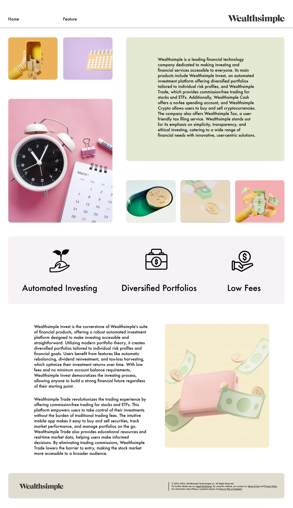
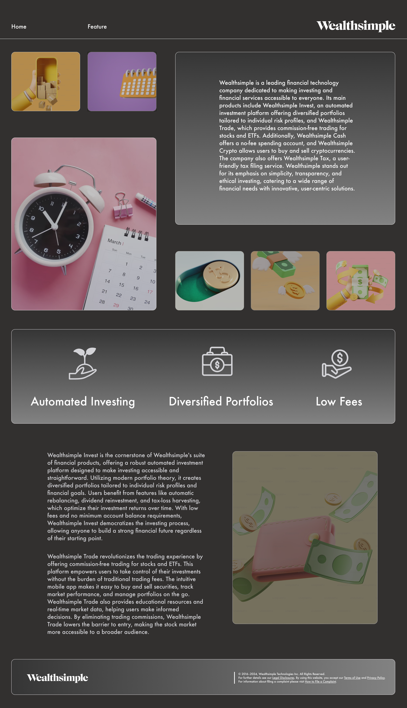
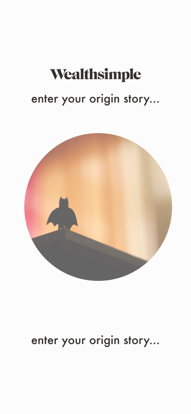
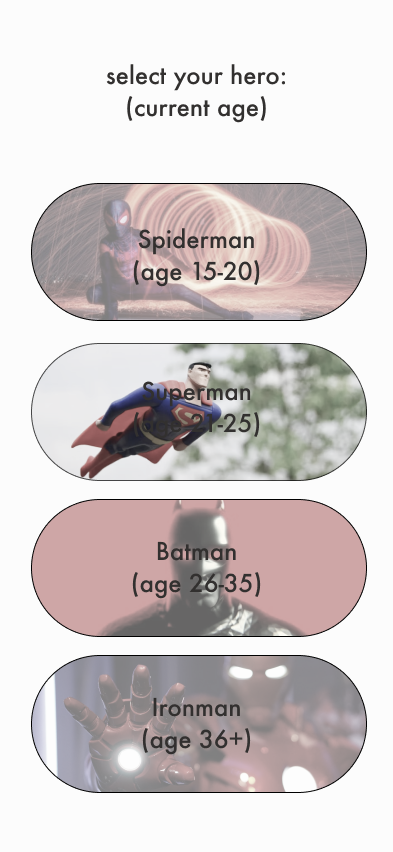
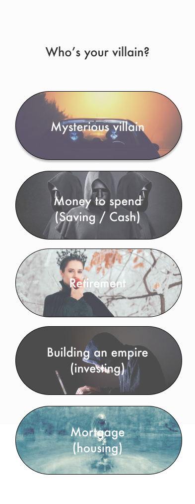
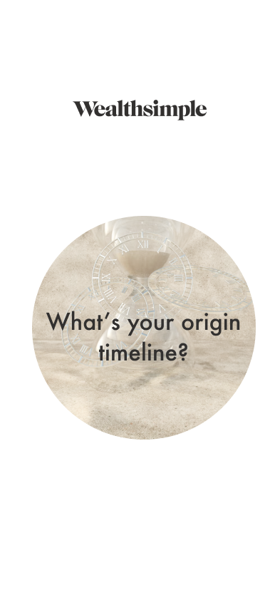
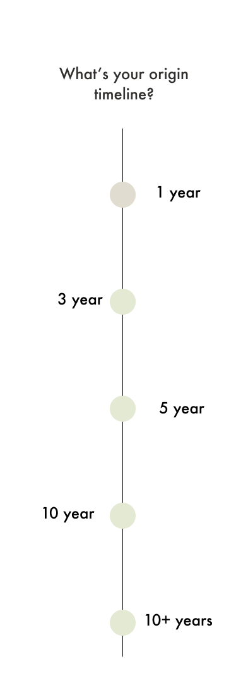
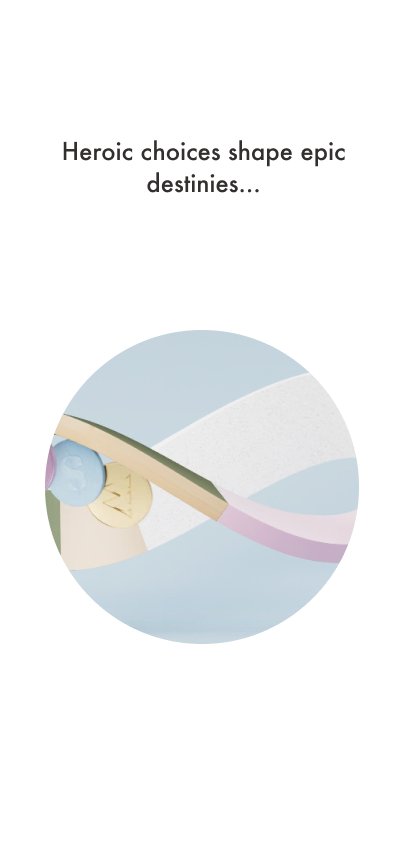
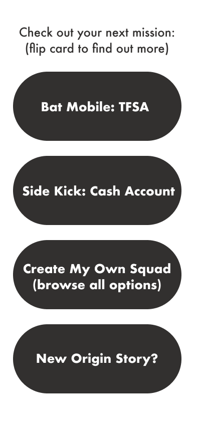
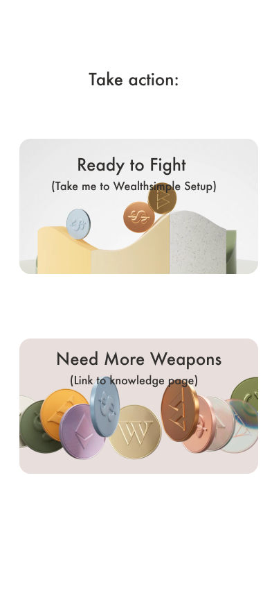

# WealthSimple Industry Project

### Brought to you by team members:

- Blaine (@blainef)
- Crystina (@crystdang)
- Grace (@mulumbagrace)
- [**Maggie**](https://www.linkedin.com/in/mzhangarch/)  (@zmjcan)
- Rabia (@rabiaabdurrehman)

###

- TA: Charu Jain

### To run this project:
- run our backend server in node environment (reach out for access)
- npm install
- run dev

## Mockups:

### desktop:

 

### mobile:

